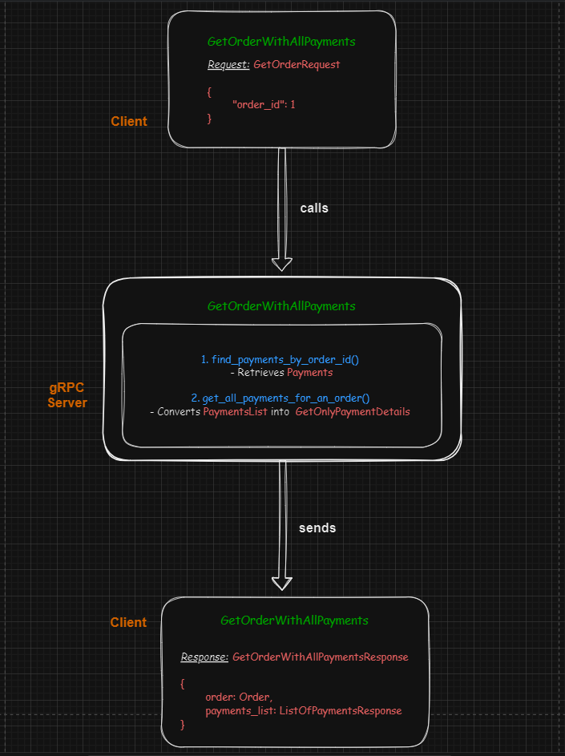
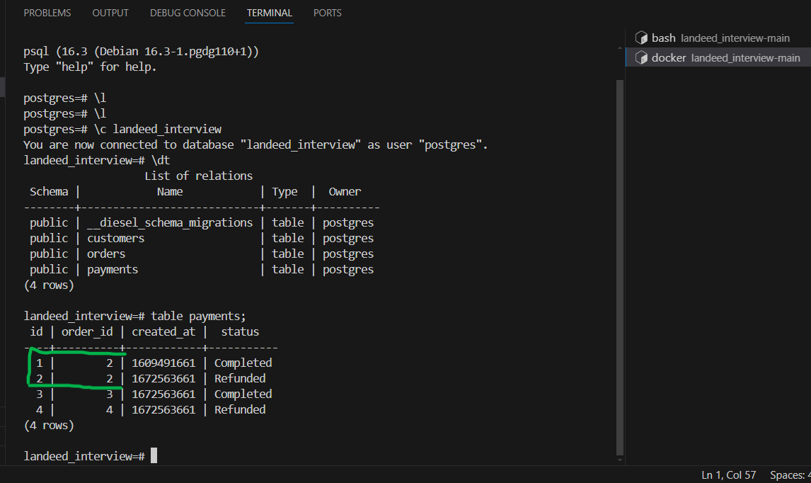
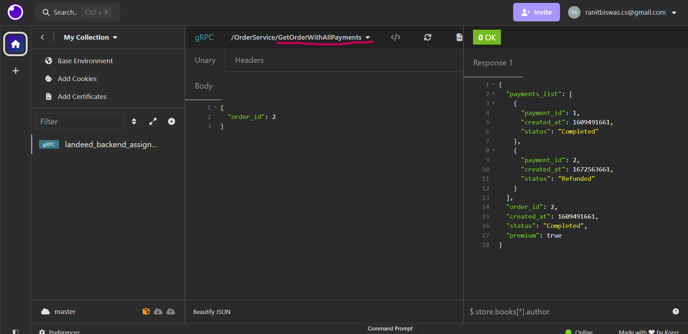

# Project Setup
## 1. Manually (cloning and building)
### i. Clone the repo
```bash
git clone --depth 1 -b master https://github.com/RhoNit/backend_assignment.git
```

### ii. Change directory to `backend_assignment`
```bash
cd backend_assignment
```

### iii. Install `diesel_cli` and install all the crates defined in `Cargo.toml`
```cargo
cargo install diesel_cli --no-default-features --features postgres 
```
N.B. Make sure you have `libpq`, `libssl` etc development packages installed beforehand
```cargo
cargo build
```

### iv. Connect your DB server and then set up diesel
```
diesel setup
```
After setting up diesel, you can check your DB server. Database would be created and all the tables would also get created at the same time (as migrations files have not been applied yet).
Here we don't need to execute `diesel migration run` cause `embed_migrations!()` macro is used in the application code. It would apply migrations automatically in runtime.

### v. Run the application
```
cargo run
```

<hr>

# OR

## 2. Using `docker-compose` and `Dockerfile`
```
docker-compose up --build
```
docker-compose first would look for the `Dockerfile` in the current context and would build an image from it. Then two containers would get created for following services `db` and `backend`

<hr>
<br>
<br>

# Changes/contributions I've made in the codebase
- [x] [protos/orders/v1/orders.proto](protos/orders/v1/orders.proto)
  - I've added a rpc Service named `GetOrderWithAllPayments` and defined a utility message `GetOnlyPaymentDetails` and a response message `GetOrderWithAllPaymentsResponse`.
  - I could have easily used the existing message structure `GetPaymentResponse` here. But I rather chose to segregate the payment response from order structure. That's why I've defined a new message named `GetOnlyPaymentDetails` here by removing the `GetOrderResponse` from payment response structure. Cause the response of `GetOrderWithAllPayments` would obviously contain order status. So it's not even required to state order status in every payment element of the `payments_list` attribute.
- [x] [src/models/payments.rs](src/models/payments.rs)
  - Here I've implemented a handler method to find all payments using `order_id` (`find_by_order_id()`) for Payment model.
- [x] [src/services/orders/utils.rs](src/services/orders/utils.rs)
  - The rpc response requires a list of all payments of an order including the order itself.
  - And for payments, I defined a custom message structure `GetOnlyPaymentDetails` in the .proto file. So, here an utility function i.e. `get_all_payments_response_for_an_order()` is implemented to fetch all the payments of a particular order, which would direcvtly be used in the response section of service function.
  - One thing to note here is each payment of the return type of this utility function would be of type `GetOnlyPaymentDetails`. So, construction of response type is also done here.
- [x] [src/services/orders/service.rs](src/services/orders/service.rs)
  - And finally in the `get_order_with_all_payments()` function, the `GetOrderResponse` and `Vec<GetOnlyPaymentDetails>` are returned as response to the client.

## Thematic Diagram of request/response associated with GetOrderWithAllPayments rpc



<br>

## Payments Table Data


<br>

## API Testing


<br>

## API Documentation (`GetOrderWithAllPayments`)
### Request
```json
{
	"order_id": 2
}
```

### Response
```json
{
	"payments_list": [
		{
			"payment_id": 1,
			"created_at": 1609491661,
			"status": "Completed"
		},
		{
			"payment_id": 2,
			"created_at": 1672563661,
			"status": "Refunded"
		}
	],
	"order": {
		"order_id": 2,
		"created_at": 1609491661,
		"status": "Completed",
		"premium": true
	}
}
```
